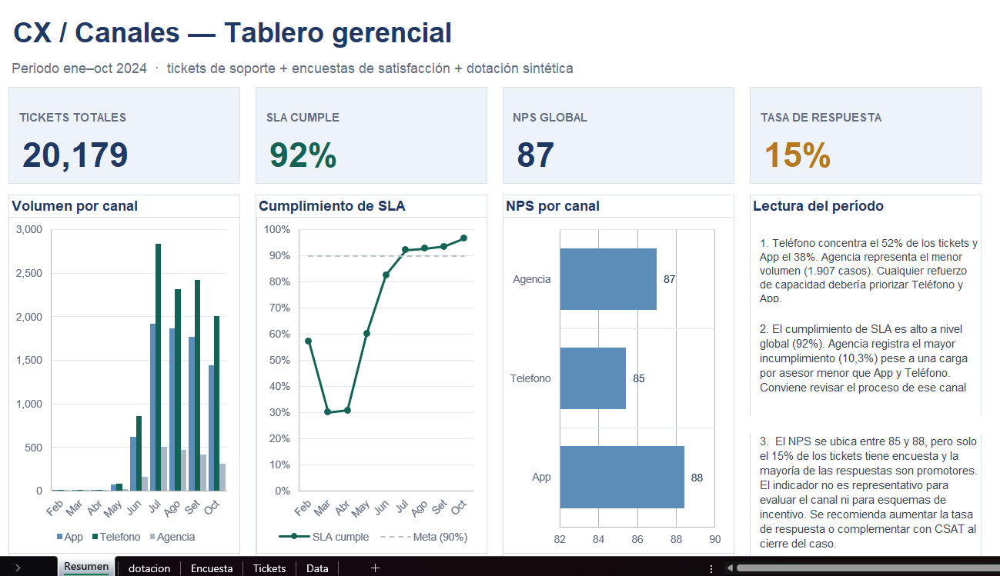

# Control gerencial de CX / canales (Excel)

Tablero en Excel para responder una pregunta de negocio:

**Si un canal de atención "está mal", ¿es por volumen, por puntualidad (SLA) o por falta de gente?**

Proyecto de portafolio — Ingeniería de Sistemas, prácticas preprofesionales en analítica de datos / CX / reportes.

## Qué problema resuelve

En atención al cliente, los datos de operación, encuestas y dotación de personal suelen estar en archivos separados. Si no se cruzan, es fácil sacar conclusiones equivocadas:

- Suben los tickets y se pide más personal, cuando el problema es realmente el proceso.
- Un NPS alto se interpreta como "el cliente está contento", cuando en realidad solo respondió una minoría.
- Un SLA bajo en un canal pequeño se trata como falta de gente, sin revisar si el proceso es el problema.

Este archivo junta las tres partes (demanda, experiencia del cliente y capacidad de personal) en un solo lugar, para poder decidir con datos y no a ojo.

## Fuentes de datos

| Archivo | Qué contiene |
|---|---|
| `data/technical_support_nps.csv` | Tickets de soporte + NPS (dataset público) |
| `data/dotacion.txt` | Dotación diaria por canal (**dato sintético**, inventado por mí): fecha, canal, número de asesores |

- Periodo analizado: enero–octubre 2024 (se excluyeron dos outliers de fechas de 2022 y 2023 que traía el dataset original).
- El dataset original venía con regiones (AMER / EMEA / APAC). Yo las usé como si fueran canales de atención: **App / Teléfono / Agencia** (a modo de ejemplo, como en un banco: app, banca telefónica y agencia física).
- El NPS del archivo original no se usó tal cual: lo recalculé con la regla estándar (promotor 9–10, pasivo 7–8, detractor 0–6).

## Qué se hizo en Excel

- **Power Query:** limpieza de tipos de dato, nulos, reglas de NPS y SLA, filtro de fechas, y cruce de tickets con dotación por `fecha + canal` (join tipo "izquierda").
- **Tablas dinámicas:** volumen, % de cumplimiento de SLA, NPS solo de quienes respondieron la encuesta, y carga de trabajo (tickets vs. promedio de asesores).
- **Hoja Resumen:** KPIs, gráficos y las conclusiones del periodo.

## Números principales

- **20.179** tickets en total.
- Teléfono concentra **52%** del volumen (10.545), App **38%** (7.727) y Agencia **9%** (1.907).
- SLA global: **92%** de cumplimiento. Agencia es el canal con más incumplimiento (**10,3%**).
- NPS por canal (solo de quienes respondieron): App **88**, Agencia **87**, Teléfono **85**.
- Tasa de respuesta de la encuesta: **15%** (3.063 encuestas de 20.179 tickets). *Nota: el perfil automático de Power Query solo revisa las primeras 1.000 filas por defecto, y con esa muestra parecía ~11% — no representa el total real.*
- Carga de trabajo (tickets ÷ asesores del día, sumados en todo el periodo): Teléfono **~5,2** y App **~4,8** tickets por asesor; Agencia **~2,3**.

## Lectura y decisiones

1. Si se va a reforzar personal, la prioridad debería ser Teléfono y App, no Agencia.
2. Agencia incumple más el SLA a pesar de tener menos carga por persona. Antes de sumar gente ahí, conviene revisar su proceso.
3. El NPS de 85–88 no es muy confiable: solo respondió el 15% y la mayoría son promotores. No debería usarse para evaluar el canal ni para dar incentivos. Conviene subir la tasa de respuesta o complementarlo con una encuesta corta (CSAT) al cerrar cada ticket.
4. Enero–marzo tienen muy poco volumen, así que el SLA de esos meses no es comparable con el del segundo semestre.

## Cómo abrir el archivo

1. Descargar `CX_Analisis.xlsx`.
2. Poner los archivos crudos en la carpeta `data/`, o actualizar las rutas dentro de Power Query si los guardas en otro lugar.
3. Ir a Datos → Actualizar todo.
4. Revisar la hoja **Resumen**.

## Limitaciones

- La dotación de personal es un dato inventado (sintético), solo para poder mostrar el cruce entre demanda y capacidad.
- El mapeo de región → canal es un supuesto mío, no representa un canal real de un banco.
- El dataset público no trae el motivo del contacto ni si el ticket se reabrió, así que no se pudo calcular FCR (resolución en el primer contacto).

## Autor

Jeanpierre Gamboa Díaz  
[LinkedIn](https://www.linkedin.com/in/jeanpierre-gamboa-diaz-86191b34a) · [GitHub](https://github.com/jeanpierre-gamboa)
